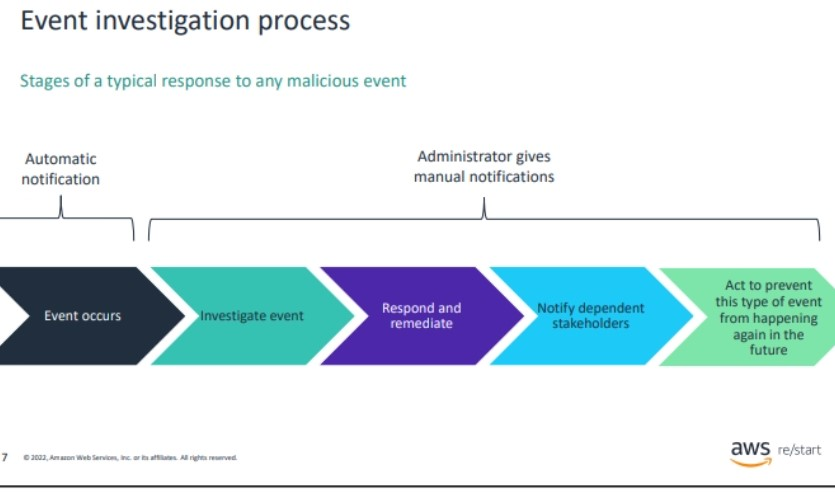

#### Response

All of these steps represent your response to an incident.
They are similar to steps that are used to respond to and investigate a security event.
• What immediate action do you take? 
• Whom do you notify?
• How do you ensure that the business can keep running in a reduced capacity?
• How can you ensure that this situation will not happen again or at least that it will be less likely to happen in the future?
• How do you get back to a normal situation?

The figure shows the typical steps that are used to respond to and investigate a security event.

When a security alert is activated, the alert must be verified because false positives can happen, especially with a system such as an automated intrusion detection system (IDS).

*  If the alert is verified, then the event must be investigated. What is the scope of the attack?

* The first step to respond to the attack is to contain infected elements if there are any, such as hosts infected by a virus. Then, block access to network addresses.

*  Notify the departments or the teams that will be affected that they might have limited access to the systems that they use. Stakeholders might be customers that won’t be able to use a website.

* Recover to get back to business as soon as possible: add security rules, rebuild infected systems, recover data, and take other appropriate steps.

*  Finally, see whether there is a way to strengthen the system to avoid another attack or recover faster. You can also implement new procedures for the team in case of an attack.

#### Understanding the business continuity plan (BCP) and disaster recovery plan (DRP)
A critical aspect of managing a business is creating strategies to prepare for any event that will disrupt the way the business normally works.

Two strategies or processes are important:
*  BCP: How to run the business in a reduced capacity 
*  DRP: How to recover from an outage or loss and return to a normal situation as quickly as possibl

##### BCP -Business Continuity Plan
The BCP is a preventive and proactive management tool. 

#### DRP-Disaster Recovery Plan
The DRP is a strategy that helps the business recover from disasters and unplanned incidents.
* Primary goal: Restore business functionality quickly and with minimum impact.
* Security goal: Do not lower the level of controls or safeguards that are in place.
* Follow-on goal: Prevent this threat, exploit, or disaster from happening again.

Two parameters for DRP

*  Recovery time objective (RTO): How quickly does the business need to be back up? 
*  Recovery point objective (RPO): How much time and data can the business afford to lose?

The maximum tolerable downtime (MTD) is the sum of the RTO and the WRT. In other words,
MTD = RTO + WRT.