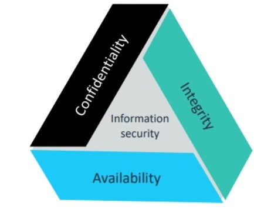
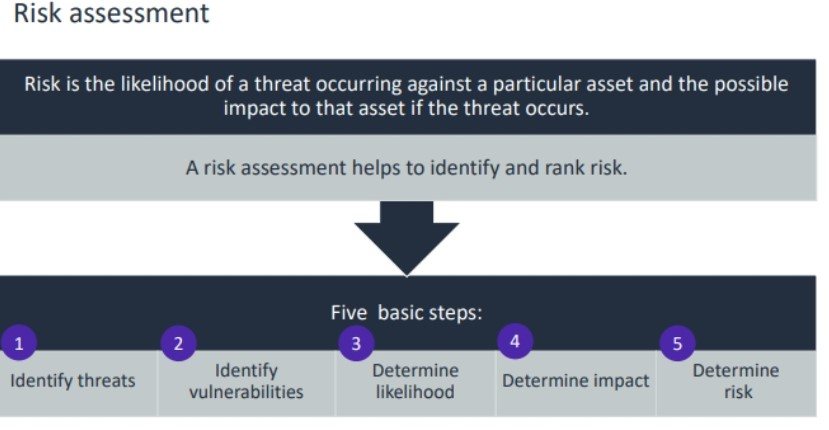

#### Confidentiality, integrity, and availability (CIA)

Information must be protected to ensure its confidentiality, integrity, and availability.

*  Confidentiality: Is private data protected to prevent unauthorized access?
* Integrity: Are measures in place to ensure that data has not been tampered with and is correct and authentic?
*  Availability: Are authorized users able to access the data when they need it?

#### Risk Assessment

##### Monitoring and Logging
The following are the benefits of monitoring and logging:
* Monitoring and logging can provide an effective way to govern IT.
*  Monitoring and logging can aid in ensuring regulatory compliance by adhering to laws, regulations, and specifications relevant to its operations.
*  Monitoring and logging can assist service level agreement (SLA) performance validation and help ensure compliance.
*  Monitoring and logging can contribute to management oversight and control.